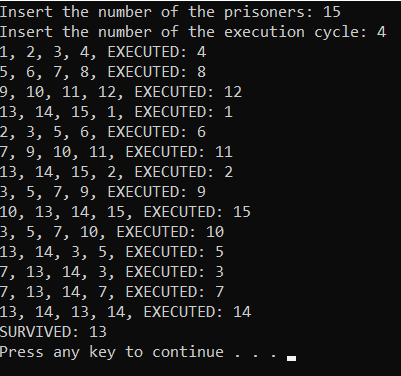

# Josephus-Problem
This is a C project that solves and displays the whole process of the Josephus problem.

What is the Josephus problem?

"In computer science and mathematics, the Josephus problem (or Josephus permutation) is a theoretical problem related to a certain counting-out game.

People are standing in a circle waiting to be executed. 
Counting begins at a specified point in the circle and proceeds around the circle in a specified direction. 
After a specified number of people are skipped, the next person is executed. The procedure is repeated with the remaining people, 
starting with the next person, going in the same direction and skipping the same number of people, until only one person remains, 
and is freed.

The problem — given the number of people, starting point, direction, and number to be skipped — is to choose the position 
in the initial circle to avoid execution."

More about the problem: https://en.wikipedia.org/wiki/Josephus_problem, https://www.geeksforgeeks.org/josephus-problem-set-1-a-on-solution

After running the program, the user will insert the number of the prisoners.

Then, the user will insert the number of the execution cycle.

After both insertions, the program will solve the problem and display each step of it.

E.g.:

The problem is being solved with the use of Queues.
